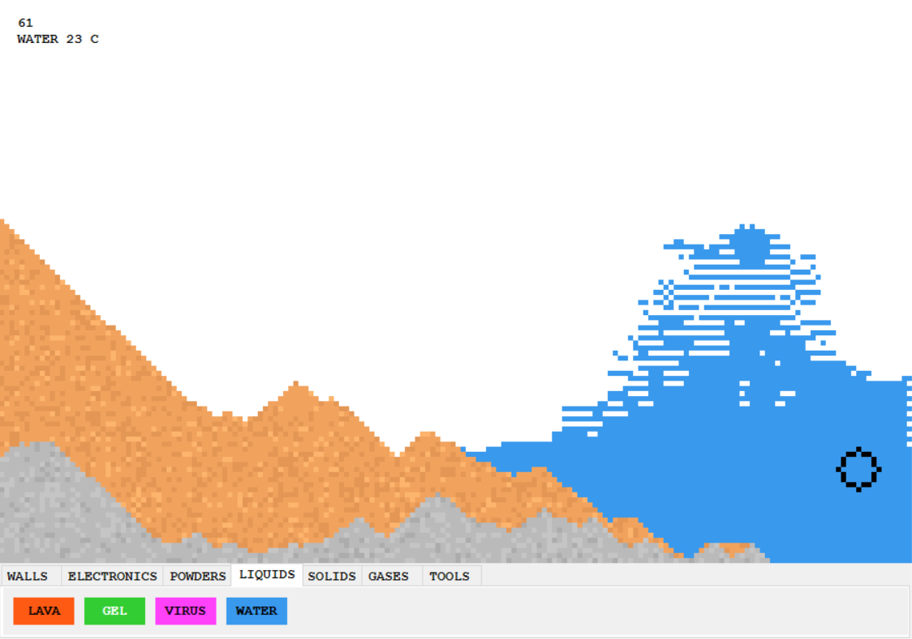
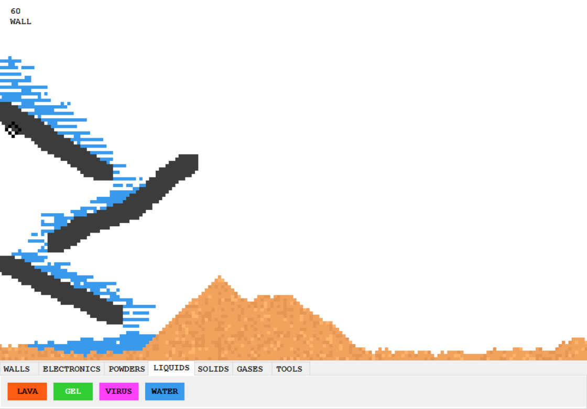
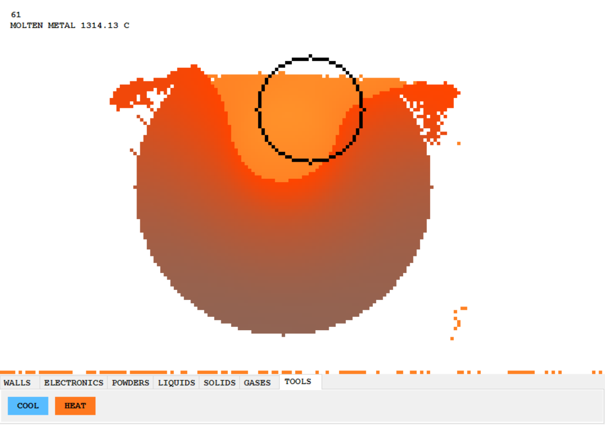

# Elemental Playground

This project is more of a sandbox for me to test different programming techniques. It's target is to achieve a similar effect to that of "The Powder Toy" but with less computational resources. 
The game currently simulates basic density, temperature, fluid dynamics and electricity.

Basic View:

The toolbar at the bottom allows you to choose from a moderately large variety of elements and tools.

Fluid Dynamics:

Heat Simulation and Molten Metal:

